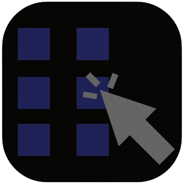

# ShortCutted
A simple shortcut manager where people can add their own public shortcuts.

ShortCutted is a free and open-source shortcut manager website. You might ask, "what's the point if you already have bookmarks?" Well, with ShortCutted, there are public shortcuts people can submit to get added to ShortCutted for anyone to view and use.

# Context
The point behind ShortCutted is that if you're someone like me who doesn't like cluttered bookmarks at the top of your browser, you can use ShortCutted to find shortcut groups. But while I was programming ShortCutted I thought, what if I make it so that anyone can upload their own public shortcut group for anyone to use.

# Instructions
Once you open ShortCutted with this link: https://vytaxx.github.io/ShortCutted/ You can scroll down and see a few options, if you want to publish your own shortcut group, press, "Submit Shortcut" then fill out the form and submit it. After that, wait a while for your shortcut group to be submitted, if your shortcut group doesn't get added after about five days, either submit again or send me an email: pcutilsdev@gmail.com.

If you're looking to use a shortcut group, press the "Shortcuts" button and you'll see all the public shortcut groups, just press on one to use it.

# How Submissions Work
When you submit a shortcut group to ShortCutted through the submissions form, I will take the URL's you submitted and and create a new HTML page for the shortcut group. Instead of putting all the shortcut pages in the main repository, I put the pages in a seperate repository dedicated to just the shortcut groups. The reason behind this is because, if I add all the pages for the shortcut groups in the main repository, it would get very comfusing and messy with all the HTML pages.

You can view that repository [here.](https://github.com/Vytaxx/ShortCutted-Submissions)

# PC Utils
ShortCutted is a software from PC Utils which is owned and developed by Vytaxity. 
Check out other software on the [PC Utils Website.](https://sites.google.com/view/pcutilsdev/)

# Contact
If you need to contact me for any reason please use the following platforms to reach me:
- Gmail: pcutilsdev@gmail.com
- LinkTree: https://linktr.ee/vytaxx/
- Discord: https://discord.gg/vc9nVuxjUM

# License

This project is licensed under the PolyForm Noncommercial License 1.0.0. Read the full license [here.](https://github.com/Vytaxx/ShortCutted/blob/main/LICENSE.md)

Commercial use is prohibited.
